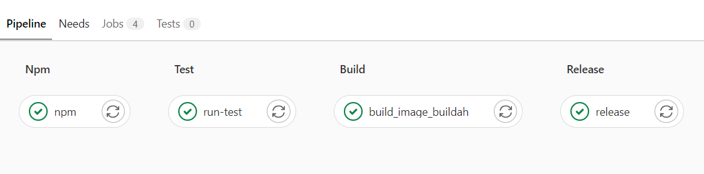

# Gitlab-docker-nodejsapp

App deployed on Heroku using Gitlab CI/CD pipeline

[Heroku Site](https://cicd-nodejsapp.herokuapp.com/)
[Gitlab repo](https://gitlab.com/mhcheng1/docker-nodejs)

Pipeline Stages

1. Install npm packages
2. Run testings
3. Build container image with buildah and push to Heroku
4. Deploy on Heroku when merged into master branch

 
Steps for whole process

1. Build nodejs app running on localhost
2. Create Dockerfile and create docker image and run container on localhost
3. Test deploying docker image to Heroku directly
4. Connect Gitlab repo to Github
5. If using Gitlab shared runner skip step 6-7
6. Setup Gitlab runner using docker-compose.yml
7. Configurate runner with config.toml for security access
8. Setup .gitlab-ci.yml for pipeline stages
9. Add env variable for Heroku API key in settings

 

## Setup

### Running Docker on localhost 8080 with exposed 8080 port

`docker run -p 8080:8080 <image id>`
 

### Deploy local docker image to heroku

Commands

`heroku container:login`

`docker tag <image> registry.heroku.com/<app-name>/web`

`docker push registry.heroku.com/<app-name>/web`

`heroku container:release -a <app-name> web`

 

### Guide for setting up own gitlab runner
[https://bwgjoseph.com/how-to-setup-and-configure-your-own-gitlab-runner]

 

### Setup CICD pipeline on Gitlab for Heroku deployment

Helpful guide:

[https://alediaferia.com/2019/12/07/continuous-deployment-gitlab-docker-heroku/]

Notes:

Setup environment API key for heroku

 

### Useful docker commands

Build an image with your image name

`docker build -t <image name> . `

List all containers running or not

`docker ps -a`

List all images

`docker images`

Remove

`docker rm`

Run container with image id

`docker run <image id>`

Create share volume to persist files

`docker volume create <folder name>`